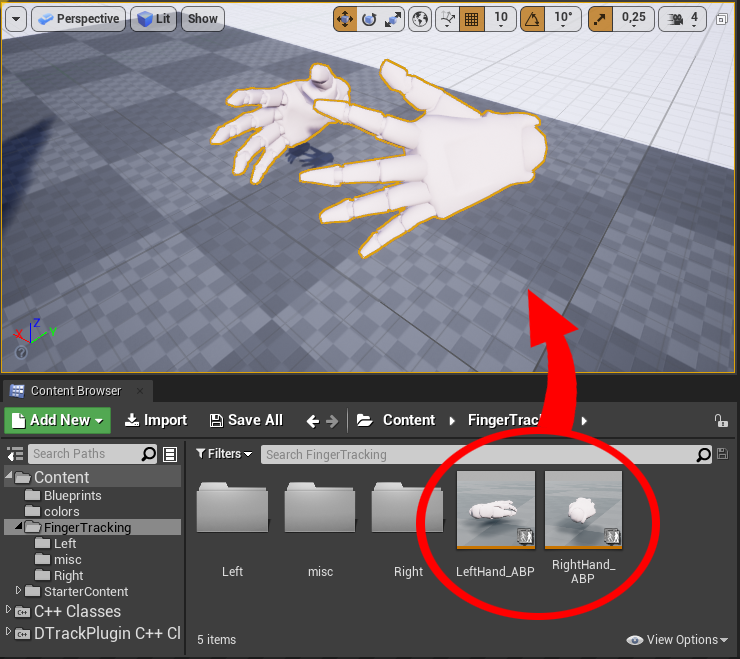
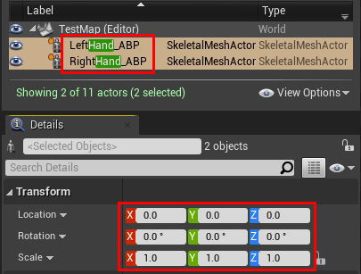
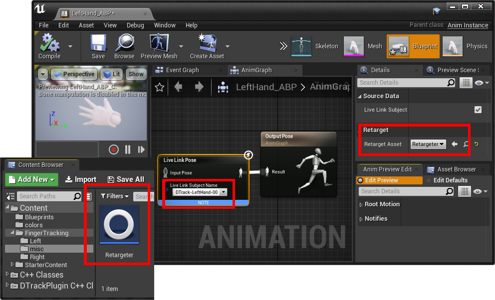

# DTrack Plugin for Unreal Engine 4/5 - Sample Scene

An _Unreal Editor_ project to demonstrate _[UnrealDTrackPlugin][2]_ features.

## Installation

### Install the Plugin
- Download _[UnrealDTrackPlugin][2]_ from _Github_ and follow the installation instructions there
 (Download via _[Unreal Engine Marketplace][4]_ is planned for a later point in time)

### Configure DTrack

- Calibrate or re-adjust your DTrack room coordinate system so that
  * the origin is close to the area where you later want to track your ART targets
  * the Z axis points upwards  
- See the documentation of _[UnrealDTrackPlugin][2]_ and the _DTrack User Manual_ for more details on room calibration and adjustment.
- Open the DTrack2 UI and configure your output data stream (*Tracking > Output*): 
  Set the _UDP port_ to _5000_, and enable output of `6d`, `6df2` or `gl` depending on your available hardware.
- Start the DTrack measurement of your bodies and/or flysticks.

### Configure the sample project
- Download and copy _[UnrealDTrackSample][3]_ into your _Unreal Editor_ project directory
- Adopt the _.uproject_ file to your Unreal Engine version (e.g. set _"EngineAssociation": "4.27"_)
- If using Unreal Engine 4 (instead of 5) prepare _UnrealDTrackPlugin_ as described in _[UnrealDTrackPlugin][1]_
- Open the *.uproject in _Unreal Editor_ and agree to rebuild the project
- Ignore any error complaining that _TestMap_BuildData_ is missing - this file was removed to reduce project size. 
  In _Unreal Editor_ click the _Build_ button in the toolbar to rebuild the map _TestMap_, then save the map
- In *Edit > Plugins* search for *DTrackPlugin* and enable it
- In the *Window > Live Link* (UE4) or *Window > Virtual Production > Live Link* (UE5) dialog add the Source *DTrack* and configure *DTrack Settings > Server Settings*

 

## DTrack Live Link Source Configuration

The following screenshots show an example Live Link configuration for DTrack.  
Note that the DTrack data stream is split into three _Roles_:
- a _Transform Role_ for 6DoF data (of standard bodies as well as Flystick bodies),
- a _DTrackFlystickInput Role_ for Flystick button and joystick data,
- a _DTrackHand Role_ for Fingertracking data

 

  

## Transform Role Configuration

In the Editor window, select either the _Cone_ or the _Cube_.
In the _Details_ tab of this actor, select the component _LiveLinkComponentController_.
In the _Live Link_ section of this component you will find Role and Live Link Subject this actor is associated with.

For 6D transformations this is always a _Transform Role_ (_DTrackFlystickInput Role_ is discussed below).
Here, the _Cone_ is configured to be controlled by a standard 6DoF body with _DTrack ID 1_ ('_DTrack-Body-00_'), the _Cube_ is controlled by a Flystick 6DoF body with _DTrack ID F1_ ('_DTrack-FlystickBody-00_').

At this point, when you look to the Editor viewport, either _Cone_ or _Cube_ should already move in sync with corresponding targets tracked by DTrack (if the Edtior's _Viewport Options_ are set to _Realtime_).

  

 

## DTrackFlystickInput Configuration

_[UnrealDTrackPlugin][2]_  maps Flystick buttons and joystick via a custom _A.R.T. Flystick_ device.
Note that _[UnrealDTrackPlugin][2]_ can be used with the new __Enhanced Input__ system (since UE4.26) as well as the 'legacy' input system (in _Edit > Project Settings > Engine > Input_, marked as deprecated in UE5.1).

  

Actions and axis values triggered by the Flystick are then handled by the Playercontroller _FlystickCtrl_BP_ (in the Content Browser under _Content > Blueprints_).
This contains a simple script which demonstrates that Flystick data are actually passed-through by the plugin: The joystick rotates the player camera, and button presses lead to either jumps in camera location or a message printed to the screen.

  

The _Level Blueprint_ of _TestMap_ then associates the PlayerController with the Pawn _MyPawn_BP_ in the scene.

  

The game mode _MyMode_BP_ uses _FlystickCtrl_BP_ as the Playercontroller class, and is itself set up as the default game mode used by _TestMap_.

  

Finally you can test this configuration in _Play In Editor_ (PIE) mode.

 

## Fingertracking

In case you have a _Fingertracking_ set connected to your _A.R.T. tracking system_, you can send the corresponding data to your _Unreal_ application just as you did with standard bodies and Flystick.
To use such data in this demo project go to _Content > FingerTracking_, select the assets _LeftHand_ABP/RightHand_ABP_ and drop them into the scene:

Note that the Unreal hand locations and orientations only correspond to the DTrack room coordinate system if for both hands in _Unreal Editor &gt; Details &gt; Transform_ all values for rotation and location are set to `0`, and for scale to `1`.

To view movement of hands and fingers directly within the scene, enable _Play > Simulate_. Alternatively, you can also switch to _Play In Editor_ (PIE) mode. 

The asset _misc > Retargeter_ is a Blueprint derived from _DTrackLiveLinkRetargetAsset_, which is part of _DTrackPlugin_.
The folders _Left_ and _Right_ contain skeletons and meshes which are edited versions of the SK_Mannequin.
The assets _LeftHand_ABP_ and _RightHand_ABP_ are AnimationBlueprints associated with the target skeletons _LeftHand_Skeleton_ and _RightHand_Skeleton_, respectively.
Here, the _Live Link Pose_ node is associated with _Retargeter_, and its subject is set to one of the _DTrackHand Role_ instances configured earlier:

 

## Preparation of Shipping and Development Builds

The procedure above assumes you manually configure DTrack as a Live Link source each time you start _Unreal Editor_.
For shipping or developement builds you can automate this step by first creating a _Live Link Preset_ in the _Window > Live Link_ dialog:

  

Next you apply this preset in the _Level Blueprint_: Create a variable of type _Live Link Preset_ and compile the Blueprint. The _Details_ tab then offers you a slot for the default value, which you set to the saved preset. You then connect an _Apply to Client_ node to the execution path of the _Begin Play_ event, with the preset as target.

___Note___: Currently the Flystick (buttons and joystick) to work correctly with packaged builds requires to first start the game, and then the DTrack measurement. Make sure that DTrack measurements are stopped before starting the game.

___Note___: If the project cannot be opened via the Launcher, but only via the Editors file menu, you presumably have to adjust the _.uproject_ file to the version of your _Unreal Editor_. Follow the corresponding installation step in _[UnrealDTrackPlugin][1]_.

[1]: https://github.com/ar-tracking/UnrealDTrackPlugin#Preparation
[2]: https://www.github.com/ar-tracking/UnrealDTrackPlugin
[3]: https://www.github.com/ar-tracking/UnrealDTrackSample
[4]: https://www.unrealengine.com/marketplace/en-US/store

