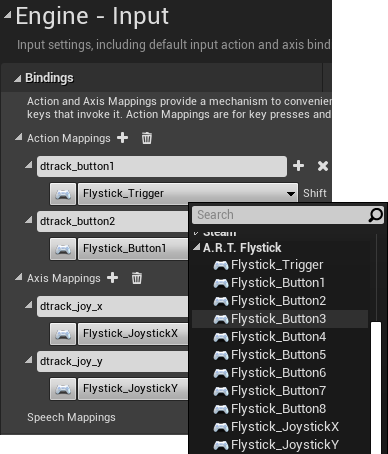

# DTrack Plugin for Unreal Engine 4 Sample Scene

An _UE4Editor_ project to demonstrate _[UnrealDTrackPlugin][2]_ features.

## Installation

### Install the Plugin
- Download the plugin via _[UE4 Marketplace][4]_
- Alternatively, download _[UnrealDTrackPlugin][2]_ from _Github_ and follow the installation instructions there

### Configure DTrack

- Calibrate or re-adjust your DTrack room coordinate system so that
  * the origin is close to the area where you later want to track your ART targets
  * the Z axis points upwards  
  
  See the documentation of _[UnrealDTrackPlugin][2]_ and the _DTrack User Manual_ for more details on room calibration and adjustment.
  
- Open the DTrack2 UI and configure your output data stream (*Tracking > Output*): 
  Set the _UDP port_ to _5000_, and enable output of `6d` and `6df2`.
  
- Start the DTrack2 measurement of your bodies and/or flysticks.

### Configure the sample project
- Download and copy _[UnrealDTrackSample][3]_ into your _UE4Editor_ project directory
- Open the *.uproject in _UE4Editor_ and agree to rebuild the project
- Ignore any error complaining that _TestMap_BuildData_ is missing - this file was removed to reduce project size. 
  In _UE4Editor_ click the _Build_ button in the toolbar to rebuild the map _TestMap_, then save the map
- In *Edit > Plugins* search for *DTrackPlugin* and enable it
- In the *Window > Live Link* dialog add the Source *DTrack* and configure *DTrack Settings > Server Settings*

 

## DTrack Live Link Source Configuration

The following screenshots show an example Live Link configuration for DTrack.  
Note that the DTrack data stream is split into two _Roles_:
- a _Transform Role_ for 6DoF data (of standard bodies as well as Flystick bodies)
- and a _DTrackFlystickInput Role_ for Flystick button and joystick data.

 

  

## Transform Role Configuration

In the Editor window, select either the _Cone_ or the _Cube_.
In the _Details_ tab of this actor, select the component _LiveLinkComponentController_.
In the _Live Link_ section of this component you will find Role and Live Link Subject this actor is associated with.

For 6D transformations this is always a _Transform Role_ (_DTrackFlystickInput Role_ is discussed below).
Here, the _Cone_ is configured to be controlled by a standard 6DoF body with _DTrack ID 1_ ('_DTrack-Body-00_'), the _Cube_ is controlled by a Flystick 6DoF body with _DTrack ID F1_ ('_DTrack-FlystickBody-00_').

At this point, when you look to the Editor viewport, either _Cone_ or _Cube_ should already move in sync with corresponding targets tracked by DTrack.

  

 

## DTrackFlystickInput Configuration

The DTrackPlugin currently maps Flystick buttons and joystick to Gamepad functions, as listed in _DTrackFlystickInputDevice.cpp_ within the _DTrackPlugin\Source\DTrackInput\Private_ directory.
In _Edit > Project Settings > Engine > Input_ you can find the mapping of Gamepad functions to actions and axes used in this project.

  

Actions and axis values triggered by the Flystick are then handled by the Playercontroller _FlystickCtrl_BP_ (in the Content Browser under _Content > Blueprints_).
This contains a simple script which demonstrates that Flystick data are actually passed-through by the plugin: The joystick rotates the player camera, and button presses lead to either jumps in camera location or a message printed to the screen.

  

The _Level Blueprint_ of _TestMap_ then associates the PlayerController with the Pawn _MyPawn_BP_ in the scene.

  

The game mode _MyMode_BP_ uses _FlystickCtrl_BP_ as the Playercontroller class, and is itself set up as the default game mode used by _TestMap_.

  

Finally you can test this configuration in _Play In Editor_ (PIE) mode.

 

## Preparation of Shipping and Development Builds

The procedure above assumes you manually configure DTrack as a Live Link source each time you start _UE4Editor_.
For shipping or developement builds you can automate this step by first creating a _Live Link Preset_ in the _Window > Live Link_ dialog:

  

Next you apply this preset in the Level Blueprint: Create a variable of type _Live Link Preset_ and compile the Blueprint. The _Details_ tab then offers you a slot for the default value, which you set to the saved preset. You then connect an _Apply to Client_ node to the execution path of the _Begin Play_ event, with the preset as target.

___Note___: Currently the plugin cannot handle a restart of the _Live Link_ source. If the DTrack _Live Link_ source is already set up (manually or automatically), starting a new game in _Play-in-Editor_ mode will not work with the preset mechanism described above. A simple workaround is to restart the Editor in this case, and generally to disconnect the _Apply to Client_ node from the execution path as long as you do not need a packaged build.

___Note___: If the _LiveLink_ connection worked in the viewport as well as in PIE mode, but does not work with shipping builds, you presumably have to adapt the _.uplugin_ file to the version of your _UE4Editor_. Follow the corresponding installation step in _[UnrealDTrackPlugin][1]_.

[1]: https://github.com/ar-tracking/UnrealDTrackPlugin#Preparation
[2]: https://www.github.com/ar-tracking/UnrealDTrackPlugin
[3]: https://www.github.com/ar-tracking/UnrealDTrackSample
[4]: https://www.unrealengine.com/marketplace/en-US/store

